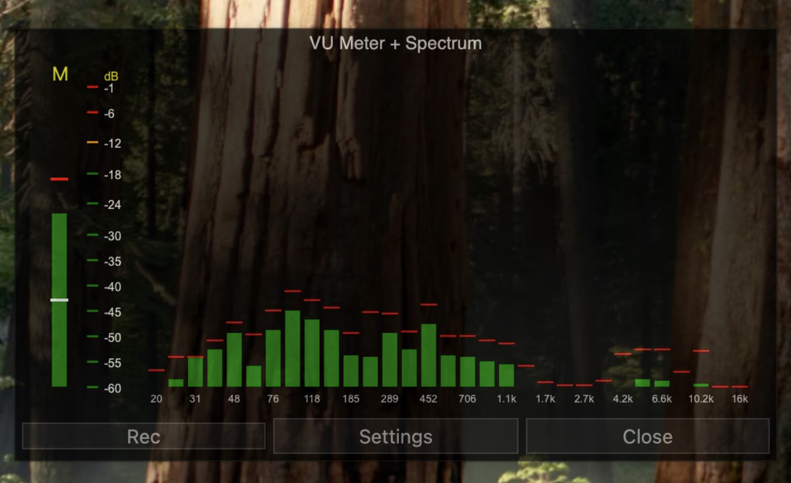

# VU Meter

Инструмент для мониторинга уровня звука и частотного анализа в реальном времени для macOS. Приложение позволяет отслеживать громкость, предотвращать перегрузки (клиппинг) и записывать аудио высокого качества.



## Основные возможности

* **Индикаторы уровня (VU Meter)**: Раздельный мониторинг левого (L) и правого (R) каналов.
  * *Зеленый*: Безопасный уровень сигнала.
  * *Желтый/Оранжевый*: Оптимальный уровень для записи.
  * *Красный*: Пиковые значения.
  * Включает функцию *Peak Hold* (тонкие красные черточки), показывающую самый громкий момент за последнее время.
* **Спектроанализатор**: Визуализация распределения частот от 20 Гц (басы) до 20 кГц (высокие) в реальном времени.
* **Режимы отображения (Metering)**:
  * *RMS + PEAK* (по умолчанию): Контроль субъективной громкости.
  * *PEAKs + RMS*: Строгий контроль пиков для защиты от перегрузок (например, при резких звуках или взрывных согласных).
* **Integration Time**: Настройка сглаживания и скорости реакции индикаторов (по умолчанию 50 мс).
* **Запись аудио (Rec)**: Запись в формате WAV с автоматическим сохранением файлов в директорию `~/Records`.

## Требования и зависимости

Для запуска исходного кода и сборки приложения потребуется:
* **ОС**: macOS
* **Python**: 3.8+
* **Системные утилиты**: `bash`, `sed`, `codesign`, `hdiutil`, `osascript` (встроены в macOS).

Установка необходимых Python-библиотек:
```bash
pip3 install PyQt6 numpy scipy sounddevice pyinstaller
```

## Сборка

Откройте терминал, перейдите в папку с проектом и выполните:
```bash
chmod +x build_VUmeter.sh
./build_VUmeter.sh
```
Этапы работы скрипта
PyInstaller: Компилирует код в пакет VU Meter.app без вывода консольного окна.

Патч Info.plist: Добавляет обязательный для macOS ключ NSMicrophoneUsageDescription. Без него система заблокирует доступ к микрофону, и спектроанализатор не будет работать.

Codesign: Переподписывает бандл приложения для обхода базовых ограничений Gatekeeper.

Создание DMG: Упаковывает приложение в образ. С помощью AppleScript скрипт автоматически настраивает размер окна и позиционирует иконки на кастомном фоне.

Важно: В процессе скрипт поставит терминал на паузу. Вы сможете визуально проверить расположение иконок в открывшемся окне DMG и, при необходимости, подвинуть их мышкой. После этого нажмите любую клавишу в терминале для завершения сборки.
